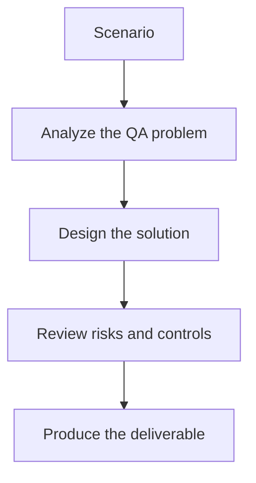

# Exercise 02: Investigate Contract Drift

## Objective

Practice comparing a declared spec to real API behavior.

## Scenario

The live API now returns a required field as nullable in certain cases, but the OpenAPI spec has not changed.

## Tasks

1. Describe how to detect the mismatch.
2. Explain why the change matters to downstream consumers.
3. Choose the severity for this drift.
4. Draft a concise AI-generated explanation for developers and QA.

## QA Checkpoints

- Breaking changes are identified clearly.
- Spec and live behavior are compared with evidence.
- Consumer impact is part of severity.
- Generated tests remain contract-grounded.

## Suggested Flow

## Expected Deliverable

A drift incident note with severity and impact.
