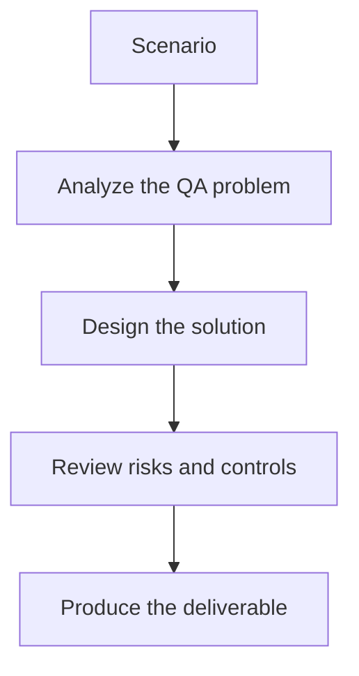

# Exercise 03: Generate Consumer-Focused Tests

## Objective

Connect contract thinking to real consumer risk.

## Scenario

A mobile team depends on a subset of the order API and wants confidence before each release.

## Tasks

1. List the consumer assumptions that must be protected.
2. Define what a generated contract test should verify.
3. Explain how mock servers help frontend or consumer teams.
4. Describe how AI should assist without inventing unsupported expectations.

## QA Checkpoints

- Breaking changes are identified clearly.
- Spec and live behavior are compared with evidence.
- Consumer impact is part of severity.
- Generated tests remain contract-grounded.

## Suggested Flow

## Expected Deliverable

A contract-test design for one consumer-provider pair.
