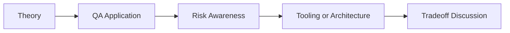

# AI-Assisted API Contract Testing: QA/SDET Interview Questions

## How to Use This Folder

These questions are designed for QA engineers, SDETs, and AI-focused testing roles. Use them for self-review, mock interviews, or classroom discussion.

### Interview Questions
1. What is API contract testing, and why is it important for distributed systems?
2. How would you detect drift between an OpenAPI spec and a live API?
3. What changes are typically considered breaking changes?
4. How can AI help generate or maintain contract tests?
5. How would you combine Schemathesis or Pact with AI-driven analysis?
6. What risks appear if teams trust generated OpenAPI specs without validation?

## Competency Map

## Strong Answer Signals

- clear explanation of the underlying concept
- strong QA framing, not just generic AI wording
- awareness of failure modes, limits, and review practices
- ability to connect tools to delivery impact and maintainability

## Discussion Guide

After you attempt the questions on your own, review the expected discussion points here:

- [answers.md](./answers.md)
