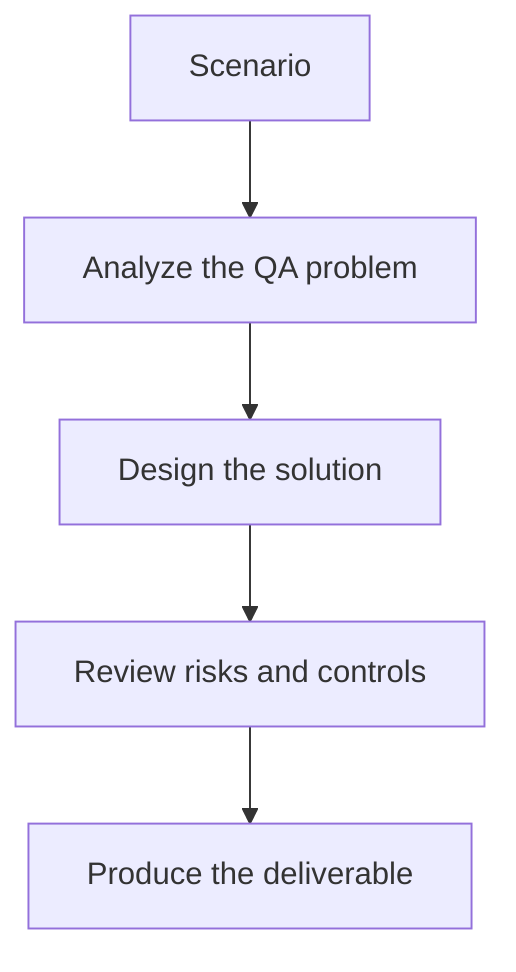

# Exercise 01: Define a Flaky-Test Detection Strategy

## Objective

Use run history to reason about instability instead of guesswork.

## Scenario

A UI suite has several tests that fail intermittently across environments and builds.

## Tasks

1. List the signals that suggest flakiness versus real product issues.
2. Choose a time window or run history to analyze.
3. Define how the team will confirm a flaky classification.
4. Describe how the results should be reported to engineers.

## QA Checkpoints

- Flakiness is evidence-based.
- Classifications are grounded in artifacts.
- Healing does not hide product defects.
- Maintenance prioritization reflects impact.

## Suggested Flow

## Expected Deliverable

A flaky-test detection strategy with evidence rules.
