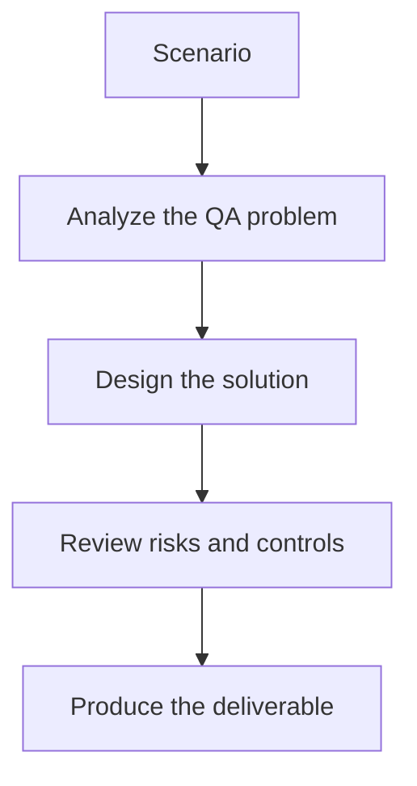

# Exercise 02: Classify Failure Root Causes

## Objective

Create a practical taxonomy for AI-assisted failure analysis.

## Scenario

Recent failures include timeouts, missing data, stale selectors, and real application bugs.

## Tasks

1. Define the root-cause categories you want the AI to predict.
2. List the evidence sources required for confident classification.
3. Explain how you will handle low-confidence classifications.
4. Describe how classifications feed maintenance prioritization.

## QA Checkpoints

- Flakiness is evidence-based.
- Classifications are grounded in artifacts.
- Healing does not hide product defects.
- Maintenance prioritization reflects impact.

## Suggested Flow

## Expected Deliverable

A root-cause taxonomy and review flow.
