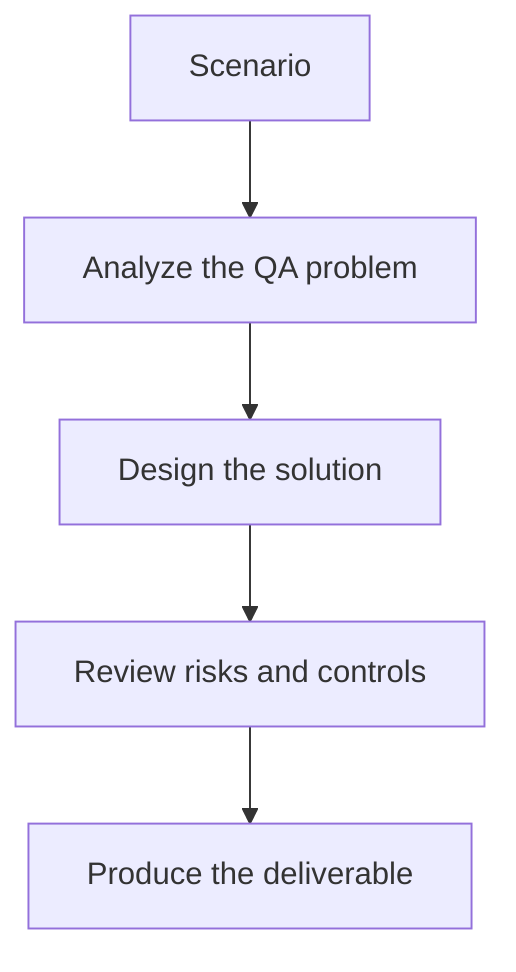

# Exercise 03: Review Locator Healing Guardrails

## Objective

Prevent self-healing from masking real product problems.

## Scenario

A Playwright suite can attempt locator healing when selectors break after UI changes.

## Tasks

1. Define which locator changes are safe to auto-suggest.
2. List the cases that require human review.
3. Explain how healed selectors should be tested before merge.
4. Describe how you would measure whether healing helps or harms suite trust.

## QA Checkpoints

- Flakiness is evidence-based.
- Classifications are grounded in artifacts.
- Healing does not hide product defects.
- Maintenance prioritization reflects impact.

## Suggested Flow

## Expected Deliverable

A locator-healing policy with QA controls.
