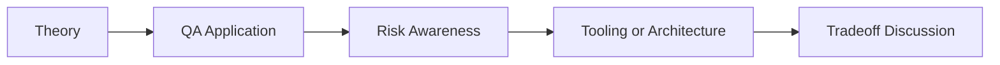

# Intelligent Test Maintenance: QA/SDET Interview Questions

## How to Use This Folder

These questions are designed for QA engineers, SDETs, and AI-focused testing roles. Use them for self-review, mock interviews, or classroom discussion.

### Interview Questions
1. What makes a test flaky, and how would you prove it with data?
2. How can AI help classify automation failures beyond simple log parsing?
3. What are the dangers of automatic locator healing?
4. How would you build trust in a flaky-test detection system?
5. What metrics belong on a test-maintenance dashboard?
6. How would you explain the tradeoff between fast healing and test reliability?

## Competency Map

## Strong Answer Signals

- clear explanation of the underlying concept
- strong QA framing, not just generic AI wording
- awareness of failure modes, limits, and review practices
- ability to connect tools to delivery impact and maintainability

## Discussion Guide

After you attempt the questions on your own, review the expected discussion points here:

- [answers.md](./answers.md)
