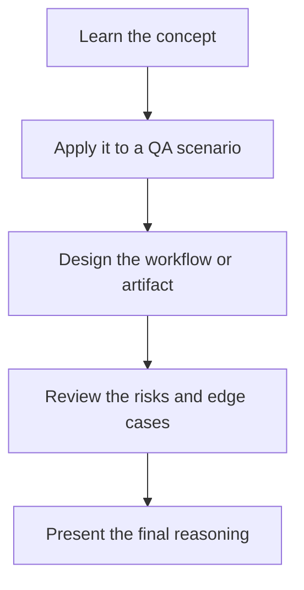

# AI Security Testing Assistant: Exercises

## Practice Goal

Use these exercises to turn the topic into QA-ready thinking and implementation steps.

### Focus Exercise: Security QA workshop

1. Create a risk-based security test checklist for a login and search flow.
2. List the payload classes you would try for XSS and SQL injection testing.
3. Design a process for reviewing AI-triaged scanner findings before escalation.
4. Write three prompt-injection tests for an LLM-powered support chatbot.

## Stretch Tasks

1. Turn one exercise into a mini design document before writing any code.
2. Identify the inputs, outputs, risks, and validation checks for the workflow.
3. Explain how you would demo this topic to a QA team in under five minutes.
4. Define one measurable success criterion for the solution.

## Exercise Flow

## Deliverable Ideas

- one-page architecture note
- prompt draft or evaluation rubric
- pseudo-code or workflow diagram
- checklist for QA review or release readiness

## Exercise Files

1. [Exercise 01](./exercise_01.md)
2. [Exercise 02](./exercise_02.md)
3. [Exercise 03](./exercise_03.md)

Work through them in order. They move from concept understanding to QA design decisions and then to risk-based review.
