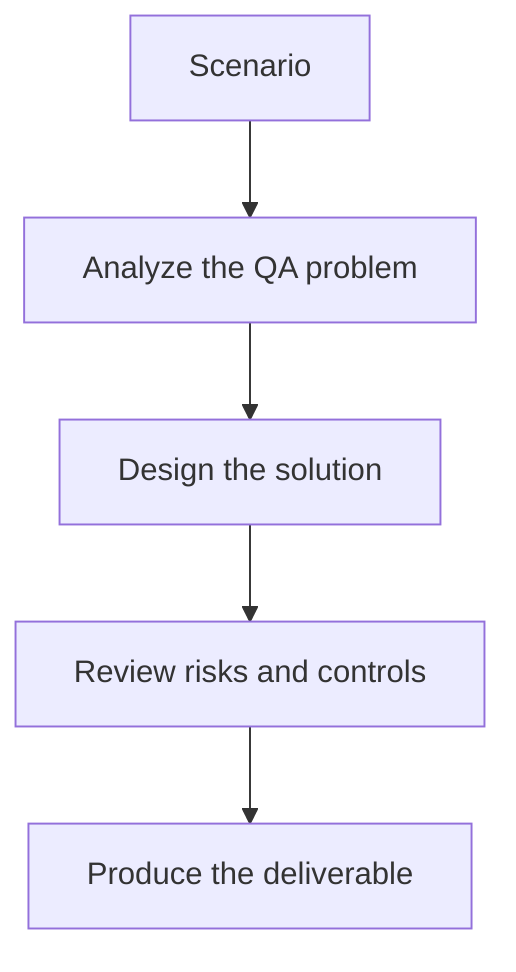

# Exercise 01: Build a Risk-Based Security Test Checklist

## Objective

Translate application context into practical QA security coverage.

## Scenario

A web app includes login, search, checkout, and an LLM-powered support assistant.

## Tasks

1. Identify the highest-risk attack surfaces.
2. Choose relevant OWASP categories for each surface.
3. Add one prompt-injection risk for the LLM feature.
4. Explain how the team will scope tests ethically and safely.

## QA Checkpoints

- Findings map to real risks.
- Payloads match execution context.
- Scanner triage remains evidence-based.
- LLM-specific threats are included alongside classic web risks.

## Suggested Flow

## Expected Deliverable

A risk-based security checklist for the application.
