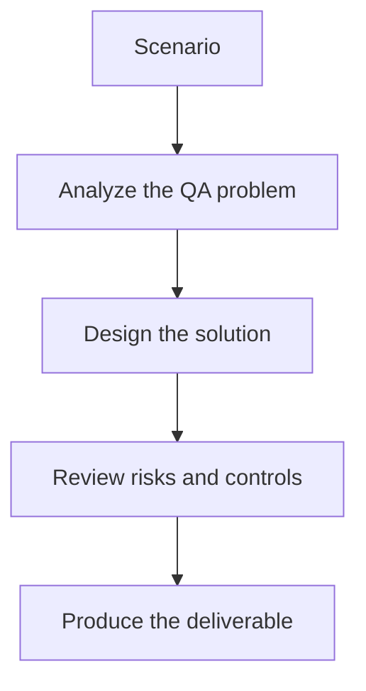

# Exercise 02: Review AI-Generated Payloads

## Objective

Evaluate whether generated payloads are targeted and meaningful.

## Scenario

An AI system proposes XSS and SQLi payloads for multiple endpoints with different contexts.

## Tasks

1. Separate payloads by context such as HTML, attribute, script, and SQL position.
2. Explain which payloads are unrealistic or noisy.
3. Define how to validate whether a payload really exercised the vulnerability.
4. List the evidence that belongs in a security defect report.

## QA Checkpoints

- Findings map to real risks.
- Payloads match execution context.
- Scanner triage remains evidence-based.
- LLM-specific threats are included alongside classic web risks.

## Suggested Flow

## Expected Deliverable

A payload review sheet with testing rationale.
