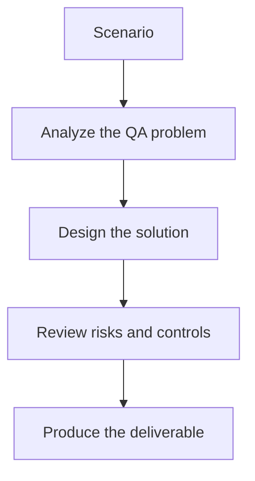

# Exercise 03: Triage Scanner Findings with AI Assistance

## Objective

Use AI to reduce noise without losing important security signals.

## Scenario

A ZAP scan produced dozens of findings, including several likely false positives.

## Tasks

1. Define the fields AI should summarize for each finding.
2. List the criteria for downgrading a likely false positive.
3. Explain how prompt-injection findings differ from classic web vulnerabilities.
4. Describe how final severity is confirmed before reporting.

## QA Checkpoints

- Findings map to real risks.
- Payloads match execution context.
- Scanner triage remains evidence-based.
- LLM-specific threats are included alongside classic web risks.

## Suggested Flow

## Expected Deliverable

A scanner-triage workflow with QA and security checkpoints.
