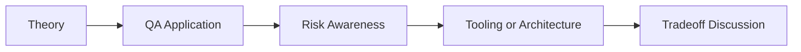

# AI Security Testing Assistant: QA/SDET Interview Questions

## How to Use This Folder

These questions are designed for QA engineers, SDETs, and AI-focused testing roles. Use them for self-review, mock interviews, or classroom discussion.

### Interview Questions
1. How can AI help QA teams participate in security testing without replacing security expertise?
2. What is the difference between direct prompt injection and indirect prompt injection?
3. How would you validate whether an AI-generated XSS or SQLi payload is meaningful?
4. Why do scanner outputs need human review even when AI summarizes them?
5. How would you teach OWASP risk thinking to a QA automation team?
6. What safeguards should exist before running AI-assisted security tests against real systems?

## Competency Map

## Strong Answer Signals

- clear explanation of the underlying concept
- strong QA framing, not just generic AI wording
- awareness of failure modes, limits, and review practices
- ability to connect tools to delivery impact and maintainability

## Discussion Guide

After you attempt the questions on your own, review the expected discussion points here:

- [answers.md](./answers.md)
